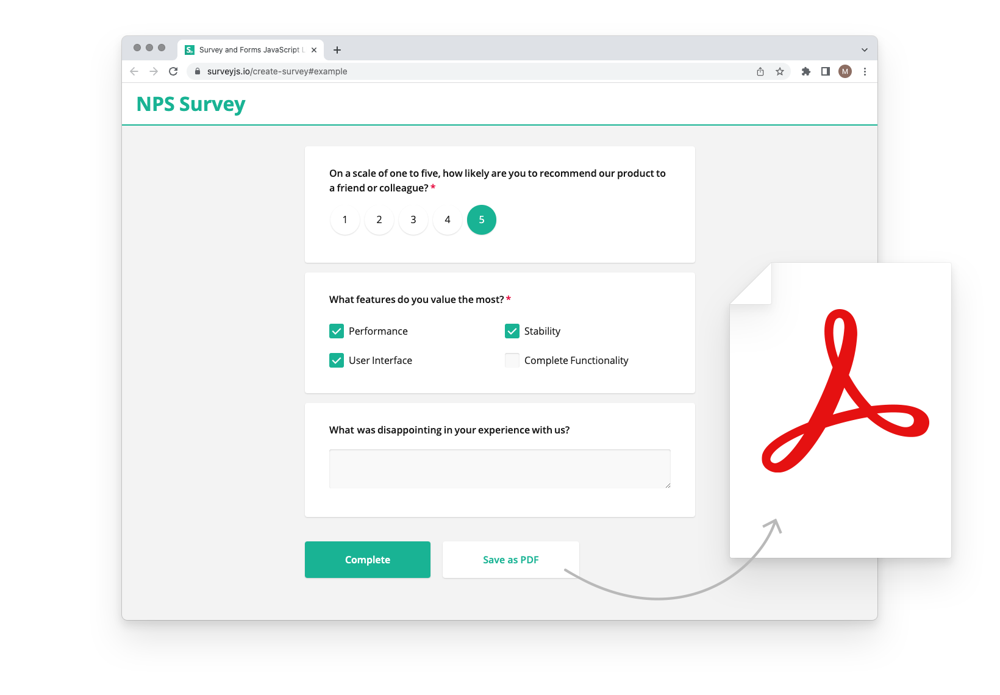

# SurveyJS PDF Generator


<video src="https://github.com/surveyjs/survey-pdf/assets/22315929/c6df9c60-a3ed-40e4-82e7-d7be3fa83fae"></video>


[](https://dev.azure.com/SurveyJS/SurveyJS%20Integration%20Tests/_build/latest?definitionId=7&branchName=master)
<a href="https://github.com/surveyjs/survey-pdf/issues">

</a>
<a href="https://github.com/surveyjs/survey-pdf/issues?utf8=%E2%9C%93&q=is%3Aissue+is%3Aclosed+">

</a>

SurveyJS PDF Generator allows you to save an unlimited number of custom-built survey forms to PDF (both blank and filled-in) and generate fillable PDF forms that your end users can edit. The PDF Generator library surves as a client-side extension for the [SurveyJS Form Library](https://github.com/surveyjs/survey-library).

### Features

- Support for all built-in SurveyJS Form Library question types
- Editable PDF forms
- Export of filled forms to PDF files
- Option to render a survey form as a PDF file for printing or downloading
- Automatic page breaks
- Markdown support
- Customizable page format and font
- Support for headers and footers both on a page and an entire survey level
- An API to download a fillable survey form as a document file in a traditional PDF format
- PDF Form conversion to Blob, Base64 URL, or Raw PDF



## Get Started

- [Angular](https://surveyjs.io/Documentation/Pdf-Export?id=get-started-angular)
- [Vue](https://surveyjs.io/Documentation/Pdf-Export?id=get-started-vue)
- [React](https://surveyjs.io/Documentation/Pdf-Export?id=get-started-react)
- [HTML/CSS/JavaScript](https://surveyjs.io/pdf-generator/documentation/get-started-html-css-javascript)

## Resources

- [Website](https://surveyjs.io/)
- [Documentation](https://surveyjs.io/Documentation/Pdf-Export)
- [Live Examples](https://surveyjs.io/Examples/Pdf-Export)
- [What's New](https://surveyjs.io/WhatsNew)

## Build SurveyJS PDF Generator from Sources

1. **Clone the repo**

    ```
    git clone https://github.com/surveyjs/survey-pdf.git
    cd survey-pdf
    ```

1. **Install dependencies**          
Make sure that you have Node.js v6.0.0 or later and npm v2.7.0 or later installed.

    ```
    npm install
    ```

1. **Build the library**

    ```
    npm run build_prod
    ```

    You can find the built scripts and style sheets in the `survey-pdf` folder under the `packages` directory.

1. **Run test examples**

    ```
    npm start
    ```

    This command runs a local HTTP server at http://localhost:7777/.

1. **Run unit tests**

    ```
    npm test
    ```

## Licensing

SurveyJS PDF Generator is **not available for free commercial usage**. If you want to integrate it into your application, you must purchase a [commercial license](https://surveyjs.io/licensing) for software developer(s) who will be working with the SurveyJS product's APIs and implementing their integration.
