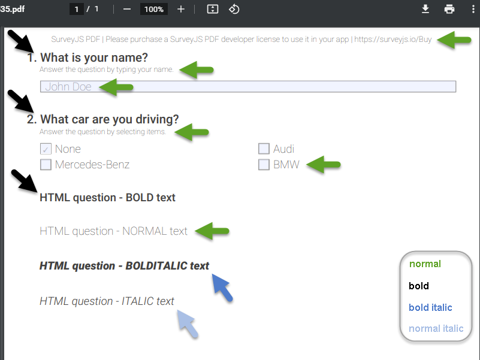

# Change Fonts

Sections in this topic:  
* [Basics](#basics)
  * [Standard 14 fonts](#standard-14-fonts)
  * [Default font](#default-font)
* [Change the document font](#change-document-font)
* [Use a custom font](#use-custom-font)
  * [Add a custom font](#add-custom-font)
  * [Set the document font](#set-document-font)
  * [Example](#example)
* [Where to find a font for a certain language](#find-font-for-certain-language)
* [How to convert .ttf file to a base64 string](#convert-ttf-to-base64)


**API to use:**  
_Switch fonts:_  
`DocOptions.fontName`  
_Load fonts:_  
`DocController.addFont()`  
_Load fonts (OBSOLETTE):_  
`DocOptions.base64Normal`  
`DocOptions.base64Bold` 


***

<a id="basics"></a>
## Basics

The **SurveyJS PDF Export** library uses a third-party [jsPDF](https://github.com/MrRio/jsPDF) library to render surveys as PDF files. 

<a id="standard-14-fonts"></a>
### Standard 14 fonts

PDF documents rendered by jsPDF support the following fonts out of the box:

- **Courier**  
typefaces: "normal", "bold", "oblique", and "bold oblique"

- **Helvetica**  
typefaces: "normal", "bold", "oblique", and "bold oblique"

- **Times**  
typefaces: "normal", "bold", "oblique", and "bold oblique"

- **Symbol**  

- **ZapfDingbats**  

The first three fonts have four typefaces each: "**normal**", "**bold**", "**oblique**" and "**bold oblique**". This results in a final set of fonts known as the [standard (or base) 14 PDF fonts](https://en.wikipedia.org/wiki/PDF#:~:text=Fourteen%20typefaces%2C%20known%20as%20the,oblique%2C%20bold%20and%20bold%20oblique).

For more details, see **jsPDF** [sources](https://github.com/MrRio/jsPDF/blob/cef97fb34eda41a8704c9f3983e680919a328ce4/src/jspdf.js#L793-L808).

>**Note:**  
The standard 14 PDF fonts only provide a limited set of glyphs but have the advantage that they don't need to be embedded into a document. These fonts are intended to be installed on a client machine and all PDF reading/viewing applications need to support them. 


<a id="default-font"></a>
### Default font

In addition to the standard 14 fonts, a PDF document generated by the **SurveyJS PDF Export** library might by default contain one more font with two typefaces:

- **Segoe**  
typefaces: "normal" and "bold"

See **SurveyPdf** [sources](https://github.com/surveyjs/survey-pdf/blob/master/src/fonts.ts) for more details.  

Segoe is the SurveyPDF's default font. Two typefaces of this font are by default embedded in a generated PDF document and are used to represent all survey texts within the document. 


<a id="change-document-font"></a>
## Change the document font

Use the `options.fontName` property to specify a document's font.

If you want to switch from the default Segoe font to one of the standard 14 fonts, set the `options.fontName` property to the desired font's family name.  
You don't need to explicitly specify typefaces (such as "normal" or "bold"). SurveyPDF automatically finds and applies required font variations (if they are available within a document).

For instance, to render a PDF document using the Courier font family, set `options.fontName` to "Courier".

```js
function saveSurveyToPdf(filename, surveyModel) {
    var options = {
        // ...
        fontName: 'Courier',
    };
    var surveyPDF = new SurveyPDF.SurveyPDF(json, options);
    surveyPDF.data = surveyModel.data;
    surveyPDF.save(filename);
}
```

Specifying any other font instead of Segoe through the `fontName` property prevents embedding Segoe fonts into a PDF document and makes Segoe typefaces unavailable within the document.


<a id="use-custom-font"></a>
## Use a custom font

Along with the use of the standard 14 fonts, the **SurveyJS PDF Export** library also allows you to integrate custom fonts into a PDF document and use them to render survey texts. 

Custom fonts are typically useful when there is a need for specific (UTF-8 encoded) glyphs which are absent in standard (ASCII-encoded) 14 fonts.

For instance, if you want to have Chinese text in your survey's PDF file, your font needs to have the necessary Chinese glyphs.

To use a custom font within a SurveyPDF document, perform the following steps:

* **Add a custom font** through the `DocController.addFont()` static method.
* **Set the document font** through the `options.fontName` property.


<a id="add-custom-font"></a>
### Add a custom font
Use the `addFont()` method to add a custom font to a PDF document.

* [addFont()]()  
`addFont(fontName: string, base64: string, fontStyle: string)`  

This method does the following:  

* Loads a font face as a base64-encoded string.
* Specifies the font variation (such as "normal" or "bold") for which to use the loaded font face in a document.
* Gives the loaded font face a label (a custom font family name/alias) which uniquely identifies the custom font through all fonts available within a document. Use this label to set the `fontName` property.

<!-- 
This method loads a font face as a base64-encoded string and associates it with a specified font family name and font style (like "normal" or "bold"). -->

A typical method call:
```js
SurveyPDF.DocController.addFont("myFont", "<<base64-encoded string>>", "normal");
```

Method parameters:

* _fontName_  
A dynamically created label to assign to the loaded custom font. This label serves as a custom font family name. Example: "myFont".

* _base64_  
 A base64-encoded string that represents the content of a custom font's .ttf file to embed.

* _fontStyle_  
A font variation for which to use the loaded custom font when rendering a PDF document. Might represent a combination of the font weight and font style. Possible values: "normal", "bold", "italic", "bolditalic".  
SurveyPDF typically uses two font variations for survey element texts: "bold" is used for texts of titles, "normal" - for texts of other elements.  
You might, however, have a need to use additional font variations within a custom HTML content you provide for questions of the HTML type ([QuestionHtmlModel](https://surveyjs.io/Documentation/Library?id=questionhtmlmodel)).


The sample code below demonstrates how to use the `addFont` method to add two custom font faces (for "normal" and "bold" font variations) and to combine them into a custom font family ("myRoboto" is used as a font family label).
```js
var fontRobotoThin = "<<base64-encoded string for Roboto-Thin.ttf>>";
var fontRobotoMedium = "<<base64-encoded string for Roboto-Medium.ttf>>";

SurveyPDF.DocController.addFont("myRoboto", fontRobotoThin, "normal");
SurveyPDF.DocController.addFont("myRoboto", fontRobotoMedium, "bold");
```


<a id="set-document-font"></a>
### Set the document font

As in the 'Change the document font' section above, set the `options.fontName` property to specify the font family used to render all texts in a survey document.  
Set this property to a custom font family identifier which you previously assigned to the loaded font(s) through the `addFont` method's _fontName_ parameter.


```js
function saveSurveyToPdf(filename, surveyModel) {

    var options = {
        // ...
        fontName: 'myRoboto',
    };
    // ...
}
```

<a id="example"></a>
### Example - Add a custom font family to SurveyPDF

The following example uses SurveyPDF to generate a survey PDF file with four Roboto fonts integrated into the document as a custom font family named 'myRoboto'.  

The Roboto-Thin and Roboto-Medium typefaces are respectively specified for two main font variations - "normal" and "bold" - used by SurveyPDF to render all survey elements.  
The Roboto-LightItalic and Roboto-BlackItalic typefaces are additionally added to represent italic variations - "normal italic" and "bold italic" - which are used in custom HTML contents within survey questions of the HTML type ([QuestionHtmlModel](https://surveyjs.io/Documentation/Library?id=questionhtmlmodel)).


```js

var json = {
    "questions": [
    // A set of survey questions including questions of the HTML type
    // ...
    ]
};

window.survey = new Survey.Model(json);
// ...

// Integrate base64-encoded representations of custom fonts into a page
var fontRobotoThin = "<<base64-encoded string for Roboto-Thin.ttf>>";
var fontRobotoMedium = "<<base64-encoded string for Roboto-Medium.ttf>>";
var fontRobotLightItalic = "<<base64-encoded string for Roboto-LightItalic.ttf>>";
var fontRobotoBlackItalic = "<<base64-encoded string for Roboto-BlackItalic.ttf>>";

// Embed custom fonts (Roboto font faces) for four font variations:
SurveyPDF.DocController.addFont("myRoboto", fontRobotoThin, "normal");
SurveyPDF.DocController.addFont("myRoboto", fontRobotoMedium, "bold");
SurveyPDF.DocController.addFont("myRoboto", fontRobotoLightItalic, "italic");
SurveyPDF.DocController.addFont("myRoboto", fontRobotoBlackItalic, "bolditalic");

function saveSurveyToPdf(filename, surveyModel) {

    var options = {
        // Specify the font family to use to render a document:
        fontName: 'myRoboto',
    };
    
    var surveyPDF = new SurveyPDF.SurveyPDF(json, options);
    surveyPDF.data = surveyModel.data;
    surveyPDF.save(filename);
}
```

See the complete example code and test it in action at Plunker:  
[Embed custom fonts to use in SurveyPDF](https://plnkr.co/edit/uyecLKbp1PrZlqtx)





<a id="find-font-for-certain-language"></a>
## Where to find a font for a certain language?

To be able to integrate a custom font into a PDF document, you first need to have a font as a .ttf (a regular TrueType font) file.

You can use online resources to search for and download language- and lettering style specific fonts.

As an example, the following Google services provide convenient ways to find and download fonts.

* [Google Noto Fonts](https://www.google.com/get/noto/)  
The Noto font family - a Google-developed collection of free fonts, which aims to support all languages. 

* [Google Fonts](https://fonts.google.com/)  
A library of more than a thousand free and open source font families.


<a id="convert-ttf-to-base64"></a>
## How to convert a ttf file to a base64 string?

You can use any of the following online tools to convert a .ttf font to a base64 string.

* [jsPDF's Font Converter](https://rawgit.com/MrRio/jsPDF/master/fontconverter/fontconverter.html)  
A font converter developed by authors of the jsPDF library.  
Accepts a .ttf file and creates a .js file to store the font content as a base64 encoded string and additional jsPDF-specific code.  
To obtain a font's base64 representation, you just need to find and copy the value of the `font` variable (`var font = "..."`) in the downloaded .js file.

* [GiftOfSpeed's File to Base64 Encoder](https://www.giftofspeed.com/base64-encoder/)  
A simplest way to encode web files to a base64 string.  
Upload a .ttf file and copy the generated string.

