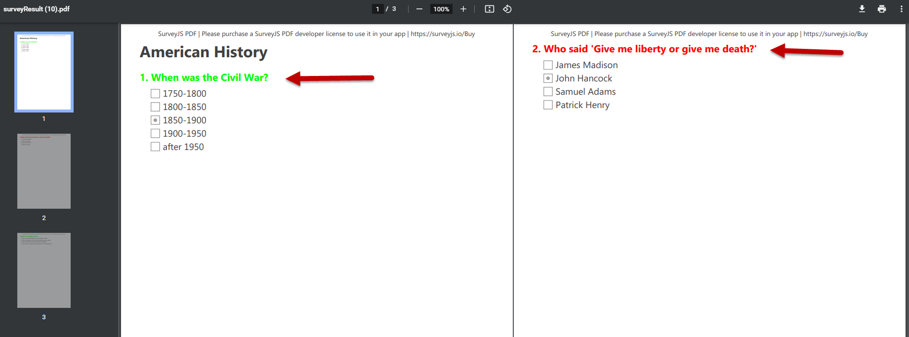
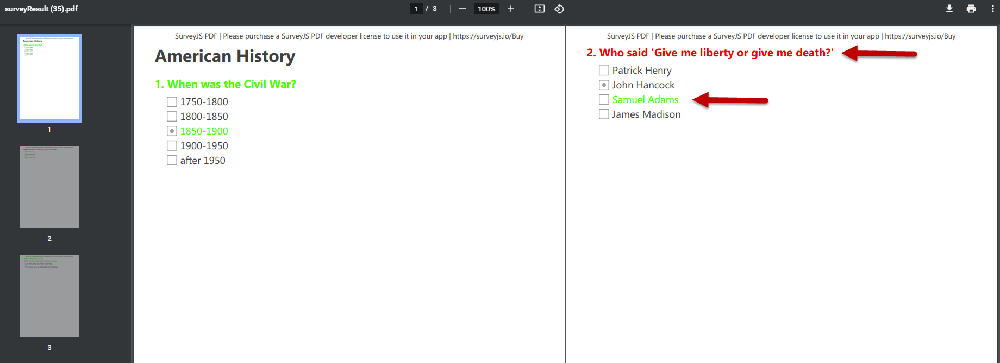

# Custom Render ― Question Elements

Sections in this topic:  
* [Handle event ― onRenderQuestion](#handle-event)
* [Use event parameter options ― AdornerOptions object](#adorneroptions-object)
  * [Bricks](#bricks)
* [How to customize question titles](#customize-question-titles)
* [How to customize question choices](#customize-question-choices)

**API to use:**  
_Event:_  
`SurveyPDF.onRenderQuestion`  
_Event parameter's popular options:_  
`options.question`  
`options.bricks`  
`PdfBrick.unfold()`  
`PdfBrick.textColor`  


<a id="handle-event"></a>
## Handle event ― onRenderQuestion

When exporting a survey to a PDF file, you can handle the [SurveyPDF](Pdf-Export?id=surveypdf) object's [onRenderQuestion](Pdf-Export?id=surveypdf#onRenderQuestion) event to access and customize structural elements of any rendered survey question. 

The event signature is as follows. 

`onRenderQuestion: EventAsync<(survey: SurveyPDF, options: AdornersOptions) => any, any>`

Two parameters are passed to event handlers: 

 - `survey` ― The event sender. A [SurveyPDF](Pdf-Export?id=surveypdf) object instance, 
 - `options` ― An [AdornerOptions](https://github.com/surveyjs/survey-pdf/blob/9d3ee98fadddd1712e96ef0499449ad786b90ee5/src/event_handler/adorners.ts#L22) object that contains the processed question's render information.


View the event sources: [declaration](https://github.com/surveyjs/survey-pdf/blob/9d3ee98fadddd1712e96ef0499449ad786b90ee5/src/survey.ts#L55), [invocation](https://github.com/surveyjs/survey-pdf/blob/9d3ee98fadddd1712e96ef0499449ad786b90ee5/src/helper_survey.ts#L564).

> **See also:**  
> `SurveyPDF.onRenderPage` ([docs](Pdf-Export?id=surveypdf#onRenderPage), [sources](https://github.com/surveyjs/survey-pdf/blob/0046cb374e9a6ea9980176557085e4896190ef7f/src/survey.ts#L69))  
> `SurveyPDF.onRenderPanel` ([docs](Pdf-Export?id=surveypdf#onRenderPanel), [sources](https://github.com/surveyjs/survey-pdf/blob/0046cb374e9a6ea9980176557085e4896190ef7f/src/survey.ts#L62)) 


<a id="adorneroptions-object"></a>
## Use event parameter options ― AdornerOptions object

An `AdornerOptions` object instance is passed to [onRenderQuestion](Pdf-Export?id=surveypdf#onRenderQuestion) event handlers as the `options` parameter. This parameter exposes the following set of properties to help you access and customize the rendered question's composite elements.

- [question](https://github.com/surveyjs/survey-pdf/blob/8d8da63d5588f6406ccefbc0699549486a4efa3b/src/event_handler/adorners.ts#L23)  
`question: IQuestion;`  
Identifies the rendered question.  

- [bricks](https://github.com/surveyjs/survey-pdf/blob/8d8da63d5588f6406ccefbc0699549486a4efa3b/src/event_handler/adorners.ts#L8)  
`bricks: IPdfBrick[];`  
An array of [PdfBrick](https://github.com/surveyjs/survey-pdf/blob/37700b1cadd051504271d0348447e3458aa8ecb8/src/pdf_render/pdf_brick.ts#L10) objects representing the question's render structure.


- [point](https://github.com/surveyjs/survey-pdf/blob/8d8da63d5588f6406ccefbc0699549486a4efa3b/src/event_handler/adorners.ts#L7)  
`point: IPoint;`

- [controller](https://github.com/surveyjs/survey-pdf/blob/8d8da63d5588f6406ccefbc0699549486a4efa3b/src/event_handler/adorners.ts#L9)  
`controller: DocController;`


- [repository](https://github.com/surveyjs/survey-pdf/blob/8d8da63d5588f6406ccefbc0699549486a4efa3b/src/event_handler/adorners.ts#L10)  
`repository: FlatRepository;`

- [module](https://github.com/surveyjs/survey-pdf/blob/8d8da63d5588f6406ccefbc0699549486a4efa3b/src/event_handler/adorners.ts#L11)  
`module: any;`


<a id="bricks"></a>
### Bricks

Within the PDF file content, question elements are represented by bricks ([PdfBrick](https://github.com/surveyjs/survey-pdf/blob/37700b1cadd051504271d0348447e3458aa8ecb8/src/pdf_render/pdf_brick.ts#L10) instances). Bricks are the most fundamental elements that are used to construct a document. 

A brick is a simple element with a specified size, contents and location that is used to display any textual and/or graphic information on a document page. A [PdfBrick](https://github.com/surveyjs/survey-pdf/blob/37700b1cadd051504271d0348447e3458aa8ecb8/src/pdf_render/pdf_brick.ts#L10) object exposes the following API.

_Position and size options:_
- `xLeft`
- `xRight`
- `yTop`
- `yBot`
- `width`
- `height`
- `isPageBreak`

_Appearance options:_
- `textColor`
- `formBorderColor`
- `fontSize`

_Methods:_
- `unfold()`
- `render()`


> **Note:**  
> If you just need to modify a brick's appearance, the simplest way is to use any of the _appearance options_, such as the text color (`textColor`) or font size (`fontSize`).


<!-- 
A brick's main options that affect its appearance are the text color, form border color, and font size.

To modify the text color of a brick, you can use the brick's [textColor](https://github.com/surveyjs/survey-pdf/blob/37700b1cadd051504271d0348447e3458aa8ecb8/src/pdf_render/pdf_brick.ts#L19) property.
 -->


When working with bricks, the main challenges facing you as a developer are as follows:  

* understand the **structure of bricks** that compose a survey question being currently rendered into a PDF file, 
* access **certain bricks** that relate to the required question structural element (such as a question title, question description or an individual choice). 

Our documentation does not currently provide detail information about the precise brick structure used to render survey questions of different types. We consider the rendering process to be an internal logic which might change in future releases.  
However, we have an open suggestion issue - [#49](https://github.com/surveyjs/survey-pdf/issues/49) - which you can track and add to if you feel a need for such a description and you can provide illustrative use cases of question element customization required.

It appears that the fastest way to **understand how a question is rendered** within a PDF file is to insert the `debugger` statement into an `onRenderQuestion` event handler and to investigate the rendered question's structure in a browser's DevTools Console.

```javascript
surveyPDF
    .onRenderQuestion
    .add(function (survey, options) {
        debugger;
        // Your customization logic here...
        /*
        const plainBricks = options
            .bricks[0]
            .unfold();
        */        
    });
```

<!-- [!image to insert]() -->


<a id="customize-question-titles"></a>
## How to customize question titles

The code below shows how to handle the `onRenderQuestion` event to change question title colors (to highlight correct and incorrect answers) for questions of the [Radiogroup](Library/?id=questionradiogroupmodel) type.   
To modify the text color of title bricks, a brick's [textColor](https://github.com/surveyjs/survey-pdf/blob/37700b1cadd051504271d0348447e3458aa8ecb8/src/pdf_render/pdf_brick.ts#L19) property is used.

```javascript
surveyPDF
    .onRenderQuestion
    .add(function (survey, options) {
        //debugger // <-- Discover the brick structure in DevTools        
        const plainBricks = options.bricks[0].unfold();
        if (options.question.isAnswerCorrect()) {
            // Change the title color to green for correct answers:
            plainBricks[0].textColor = "#00ff00"; // A brick for number in a question title.
            plainBricks[1].textColor = "#00ff00"; // A brick for text in a question title.
        } else {
            // Change the title color to red for incorrect answers:
            plainBricks[0].textColor = "#ff0000"; // A brick for number in a question title.
            plainBricks[1].textColor = "#ff0000"; // A brick for text in a question title.
        }
        return new Promise(function (resolve) {
            resolve();
        });
    });
```

Links to the related API used in the code:  
`onRenderQuestion` ― [sources](https://github.com/surveyjs/survey-pdf/blob/9d3ee98fadddd1712e96ef0499449ad786b90ee5/src/survey.ts#L55), [docs](Pdf-Export?id=surveypdf#onRenderQuestion)  
`options` ― [sources](https://github.com/surveyjs/survey-pdf/blob/9d3ee98fadddd1712e96ef0499449ad786b90ee5/src/event_handler/adorners.ts#L22)  
`options.bricks` ― [sources](https://github.com/surveyjs/survey-pdf/blob/9d3ee98fadddd1712e96ef0499449ad786b90ee5/src/event_handler/adorners.ts#L8)  
`options.question` ― [sources](https://github.com/surveyjs/survey-pdf/blob/9d3ee98fadddd1712e96ef0499449ad786b90ee5/src/event_handler/adorners.ts#L23)  
`options.question.isAnswerCorrect()` ― [sources](https://github.com/surveyjs/survey-library/blob/198f05347ab673ab8b9d14ff5c7efebff5505330/src/question.ts#L1333)  
`PdfBrick.textColor` ― [sources](https://github.com/surveyjs/survey-pdf/blob/37700b1cadd051504271d0348447e3458aa8ecb8/src/pdf_render/pdf_brick.ts#L19)


You can see the complete sample code and test it in action in the Plunker example:  
[ SurveyPDF ― How to highlight incorrect answers in a PDF file](https://plnkr.co/edit/2QFRBxyKya1AbINR)  




There is more info about the `onRenderQuestion` event in our **Adorners** example's documentation:  
[https://surveyjs.io/Examples/Pdf-Export?id=survey-pdf-adorners#content-docs](https://surveyjs.io/Examples/Pdf-Export?id=survey-pdf-adorners#content-docs)  


<a id="customize-question-choices"></a>
## How to customize question choices

The code below shows how to handle the `onRenderQuestion` event to change the color of choices (to highlight correct choices) for questions of the [Radiogroup](Library/?id=questionradiogroupmodel) type.   
To modify the text color of choice bricks, a brick's [textColor](https://github.com/surveyjs/survey-pdf/blob/37700b1cadd051504271d0348447e3458aa8ecb8/src/pdf_render/pdf_brick.ts#L19) property is used.

This example is based on the previous example's code and extends it with the functionality of finding and highlighting the correct choice in the rendered question. 

```javascript
surveyPDF
    .onRenderQuestion
    .add(function (survey, options) {
        const plainBricks = options.bricks[0].unfold();
        // #region Titles 
        // Change the title color for correct/incorrect answers:
        if (options.question.isAnswerCorrect()) {
            plainBricks[0].textColor = "#00ff00"; 
            plainBricks[1].textColor = "#00ff00"; 
        } else {
            plainBricks[0].textColor = "#ff0000"; 
            plainBricks[1].textColor = "#ff0000";
        }
        // #endregion

        // Find a correct choice and access its text brick:
        const correctChoice = Survey.ItemValue.getItemByValue(options.question.choices, options.question.correctAnswer);
        const correctChoiceIndex = options.question.choices.indexOf(correctChoice);
        const correctChoiceRootBrick = options.bricks[correctChoiceIndex];
        //debugger // <-- Discover the brick structure in DevTools        
        const correctChoiceTextBrick = correctChoiceRootBrick.bricks[1].bricks[0];
        if (correctChoiceIndex === 0) {
            correctChoiceTextBrick = correctChoiceRootBrick.bricks[1].bricks[1].bricks[0];
        }
        // Change the correct choice's text color to green:
        correctChoiceTextBrick.textColor = "#00ff00";

        return new Promise(function (resolve) {
            resolve();
        });
    });
```

Links to the related API used in the code:  
`onRenderQuestion` ― [sources](https://github.com/surveyjs/survey-pdf/blob/9d3ee98fadddd1712e96ef0499449ad786b90ee5/src/survey.ts#L55), [docs](Pdf-Export?id=surveypdf#onRenderQuestion)  
`options` ― [sources](https://github.com/surveyjs/survey-pdf/blob/9d3ee98fadddd1712e96ef0499449ad786b90ee5/src/event_handler/adorners.ts#L22)  
`options.bricks` ― [sources](https://github.com/surveyjs/survey-pdf/blob/9d3ee98fadddd1712e96ef0499449ad786b90ee5/src/event_handler/adorners.ts#L8)  
`options.question` ― [sources](https://github.com/surveyjs/survey-pdf/blob/9d3ee98fadddd1712e96ef0499449ad786b90ee5/src/event_handler/adorners.ts#L23)  
`options.question.isAnswerCorrect()` ― [sources](https://github.com/surveyjs/survey-library/blob/198f05347ab673ab8b9d14ff5c7efebff5505330/src/question.ts#L1333)  
`Survey.ItemValue` ― [sources](https://github.com/surveyjs/survey-library/blob/e5a87a0d4c57b8cb46c5b2b16fb488868a44cdb6/src/itemvalue.ts#L18)  
`Survey.ItemValue.getItemByValue()` ― [sources](https://github.com/surveyjs/survey-library/blob/e5a87a0d4c57b8cb46c5b2b16fb488868a44cdb6/src/itemvalue.ts#L87)  
`options.question.choices` ― [sources](https://github.com/surveyjs/survey-library/blob/36f41f6ab6403044dd0bfe475ffda81cdc68cacc/src/question_baseselect.ts#L450), [docs](Library?id=QuestionSelectBase#choices)  
`options.question.choices.indexOf()` ― [docs](https://developer.mozilla.org/en-US/docs/Web/JavaScript/Reference/Global_Objects/Array/indexOf)  
`PdfBrick.textColor` ― [sources](https://github.com/surveyjs/survey-pdf/blob/37700b1cadd051504271d0348447e3458aa8ecb8/src/pdf_render/pdf_brick.ts#L19)


You can see the complete sample code and test it in action in the Plunker example:  
[SurveyPDF - How to highlight correct/incorrect answers together with correct choices in a PDF file](https://plnkr.co/edit/a4l42JoeNbaPH22m)   




There is more info about the `onRenderQuestion` event in our **Adorners** example's documentation:  
[https://surveyjs.io/Examples/Pdf-Export?id=survey-pdf-adorners#content-docs](https://surveyjs.io/Examples/Pdf-Export?id=survey-pdf-adorners#content-docs)  

