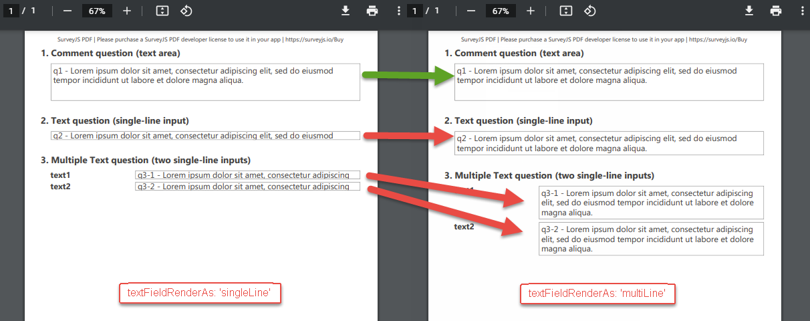

# Options in SurveyPDF Constructor

## Basics


You can pass a set of options as a parameter into a [SurveyPDF](https://surveyjs.io/Documentation/Pdf-Export?id=surveypdf)'s [constructor](https://github.com/surveyjs/survey-pdf/blob/1220a71b51daddf1c4c8d506382c50be5f1b2941/src/survey.ts#L17) to predefine settings of the resulting PDF document.

```JavaScript
var options = {
    // Specify option settings here.
    orientation: "p",
	fontSize: 14,
    //...
	}
};
var survey = new SurveyPDF.SurveyPDF(json, options);
```

**Online Example**  
[Print to PDF - Options](https://surveyjs.io/Examples/Pdf-Export?id=survey-pdf-export)

The options are declared by the [IDocOptions](https://github.com/surveyjs/survey-pdf/blob/1220a71b51daddf1c4c8d506382c50be5f1b2941/src/doc_controller.ts#L33) interface and are implemented by the [DocOptions](https://github.com/surveyjs/survey-pdf/blob/1220a71b51daddf1c4c8d506382c50be5f1b2941/src/doc_controller.ts#L53) class.


### List of Options

The following options are available (listed as they go in sources).  
 
    orientation?: 'p' | 'l';
    format?: string | number[];
    fontSize?: number;
    fontName?: string;
    base64Normal?: string;
    base64Bold?: string;
    useCustomFontInHtml?: boolean;
    margins?: IMargin;
    commercial?: boolean;
    haveCommercialLicense?: boolean;
    htmlRenderAs?: IHTMLRenderType;
    matrixRenderAs?: 'auto' | 'list';
    readonlyRenderAs?: 'auto' | 'text' | 'acroform';
    textFieldRenderAs?: 'singleLine' | 'multiLine';
    compress?: boolean;

### List of Affected Preferences
Find more details about them in the below document sections that describe the options and the affected document preferences.

- [Page orientation](#orientation)
- [Page format](#format)
- [Font size](#fontSize)
- [Font name](#fontName)
- [Setting a custom normal font](#base64Normal)
- [Setting a custom bold font](#base64Bold)
- [Ability to use custom fonts in HTML questions](#useCustomFontInHtml)
- [Page margins](#margins)
- [Commercial license](#commercial)
- [HTML question render mode](#htmlRenderAs)
- [Matrix question render mode](#matrixRenderAs)
- [Render mode of read-only questions](#readonlyRenderAs)
- [Text input render mode in read-only questions](#textFieldRenderAs)
- [Document compression](#compress)

<a id="orientation"></a>
## Page orientation

Use the [orientation](https://github.com/surveyjs/survey-pdf/blob/1220a71b51daddf1c4c8d506382c50be5f1b2941/src/doc_controller.ts#L34) option to specify the page orientation within the document.

- [orientation](https://github.com/surveyjs/survey-pdf/blob/1220a71b51daddf1c4c8d506382c50be5f1b2941/src/doc_controller.ts#L34)  
`orientation?: 'p' | 'l';`  

Possible values:  
 - "p" - specifies the portrait orientation,
 - "l" - specifies the landscape orientation.

```JavaScript
var options = {
    orientation: "p"
};
var survey = new SurveyPDF.SurveyPDF(json, options);
```

<a id="format"></a>
## Page format

Use the [format](https://github.com/surveyjs/survey-pdf/blob/1220a71b51daddf1c4c8d506382c50be5f1b2941/src/doc_controller.ts#L35) option to specify the document's page size.

- [format](https://github.com/surveyjs/survey-pdf/blob/1220a71b51daddf1c4c8d506382c50be5f1b2941/src/doc_controller.ts#L35)  
`format?: string | number[];`

Possible values:  
- "a0" - "a10"
- "b0" - "b10"
- "c0" - "c10"
- "dl"
- "letter"
- "government-letter"
- "legal"
- "junior-legal"
- "ledger"
- "tabloid"
- "credit-card"

The default value is "a4".  

```JavaScript
var options = {
    format: "a3"
};
var survey = new SurveyPDF.SurveyPDF(json, options);
```

To use a custom format, set `format` to the required page size as a number array (in mm). Example: [210.0, 297.0].

```JavaScript
var options = {
    format: [210.0, 297.0]
};
var survey = new SurveyPDF.SurveyPDF(json, options);
```


<a id="fontSize"></a>
## Font size

Use the [fontSize](https://github.com/surveyjs/survey-pdf/blob/1220a71b51daddf1c4c8d506382c50be5f1b2941/src/doc_controller.ts#L36) option to specify the base font size (in points) for the PDF document's text elements.

- [fontSize](https://github.com/surveyjs/survey-pdf/blob/1220a71b51daddf1c4c8d506382c50be5f1b2941/src/doc_controller.ts#L36)  
`fontSize?: number;`

The sizes of titles, descriptions, and text boxes will be calculated (scaled) proportionally based on the `fontSize` value.

```JavaScript
var options = {
    fontSize: 14
};
var survey = new SurveyPDF.SurveyPDF(json, options);
```

<a id="fontName"></a>
## Font name

Use the [fontName](https://github.com/surveyjs/survey-pdf/blob/1220a71b51daddf1c4c8d506382c50be5f1b2941/src/doc_controller.ts#L37) option to specify the font name or family for the PDF document's text elements.

- [fontName](https://github.com/surveyjs/survey-pdf/blob/1220a71b51daddf1c4c8d506382c50be5f1b2941/src/doc_controller.ts#L37)  
`fontName?: string;`

The default document font is Segoe.  
Two typefaces of this font (normal and bold) are by default embedded in a generated PDF document and are used to represent all survey texts within the document.  
> Specifying any other font instead of Segoe prevents embedding Segoe fonts into a PDF document and makes Segoe typefaces unavailable within the document.

Set the `fontName` option to the desired font's family name to [switch](https://surveyjs.io/Documentation/Pdf-Export?id=Customization-ChangeFonts#change-document-font) from the default Segoe font to one of the [standard 14 fonts](https://surveyjs.io/Documentation/Pdf-Export?id=Customization-ChangeFonts#standard-14-fonts) or to a [custom font](https://surveyjs.io/Documentation/Pdf-Export?id=Customization-ChangeFonts#use-custom-font) (explicitly integrated into a document through the `loadFont` method).

Example: "Courier".

```JavaScript
var options = {
    fontName: "Courier"
};
var survey = new SurveyPDF.SurveyPDF(json, options);
```

Learn more: [Change Fonts](https://surveyjs.io/Documentation/Pdf-Export?id=Customization-ChangeFonts)


<a id="base64Normal"></a>
## Setting a custom normal font

Obsoleted.  

- [base64Normal](https://github.com/surveyjs/survey-pdf/blob/1220a71b51daddf1c4c8d506382c50be5f1b2941/src/doc_controller.ts#38)  
`base64Normal?: string;`  
Notes:  
Earlier could be used together with [base64Bold](base64Bold) and [useCustomFontInHtml](useCustomFontInHtml).  

Use the loadFont method and the [fontName](#fontName) option instead.

Learn more: [Change Fonts](https://surveyjs.io/Documentation/Pdf-Export?id=Customization-ChangeFonts)


<a id="base64Bold"></a>
## Settings a custom bold font

Obsoleted.

- [base64Bold](https://github.com/surveyjs/survey-pdf/blob/1220a71b51daddf1c4c8d506382c50be5f1b2941/src/doc_controller.ts#39)  
`base64Bold?: string;`  
Notes:  
Earlier could be used together with [base64Normal](base64Normal) and [useCustomFontInHtml](useCustomFontInHtml).  

Use the loadFont method and the [fontName](#fontName) option instead.

Learn more: [Change Fonts](https://surveyjs.io/Documentation/Pdf-Export?id=Customization-ChangeFonts)


<a id="useCustomFontInHtml"></a>
## Ability to use custom fonts in HTML questions

Obsoleted.  

- [useCustomFontInHtml](https://github.com/surveyjs/survey-pdf/blob/1220a71b51daddf1c4c8d506382c50be5f1b2941/src/doc_controller.ts#40)  
`useCustomFontInHtml?: boolean;`  
Notes:  
Earlier was used together with [base64Normal](base64Normal) and [base64Bold](base64Bold) to specify whether [custom fonts](https://surveyjs.io/Documentation/Pdf-Export?id=Customization-ChangeFonts#use-custom-font) (loaded throught the `base64Normal` and `base64Bold` options) should apply to texts rendered within questions of the HTML type.  

Now [custom fonts](https://surveyjs.io/Documentation/Pdf-Export?id=Customization-ChangeFonts#use-custom-font) loaded through the [addFont()](https://github.com/surveyjs/survey-pdf/blob/e7727038e6be148a4b38753ab9dddbcaf86c23a5/src/doc_controller.ts#L186) method are always taken into account when rendering texts within questions of the HTML type.


<a id="margins"></a>
## Page margins

Use the [margins](https://github.com/surveyjs/survey-pdf/blob/1220a71b51daddf1c4c8d506382c50be5f1b2941/src/doc_controller.ts#L41) option to specify the margins for document pages.

- [margins](https://github.com/surveyjs/survey-pdf/blob/1220a71b51daddf1c4c8d506382c50be5f1b2941/src/doc_controller.ts#L41)  
`margins?: IMargin;`

```JavaScript
var options = {
    margins: {
        top: 18,
        bot: 10,
        left: 12,
        right: 10
    }
};
var survey = new SurveyPDF.SurveyPDF(json, options);
```

See also: [Custom Render - Header/Footer: Drawing area](https://surveyjs.io/Documentation/Pdf-Export?id=Customization-CustomRender-HeaderFooter#drawing-area)


<a id="commercial"></a>
## Commercial license

Use the [commercial](https://github.com/surveyjs/survey-pdf/blob/1220a71b51daddf1c4c8d506382c50be5f1b2941/src/doc_controller.ts#L42) or [haveCommercialLicense](https://github.com/surveyjs/survey-pdf/blob/1220a71b51daddf1c4c8d506382c50be5f1b2941/src/doc_controller.ts#L43) option to specify whether you have a commercial license for  the **Survey PDF Export** library.

- [commercial](https://github.com/surveyjs/survey-pdf/blob/1220a71b51daddf1c4c8d506382c50be5f1b2941/src/doc_controller.ts#L42)  
`commercial?: boolean;`

- [haveCommercialLicense](https://github.com/surveyjs/survey-pdf/blob/1220a71b51daddf1c4c8d506382c50be5f1b2941/src/doc_controller.ts#L43)  
`haveCommercialLicense?: boolean;`

Setting an option to true removes a non-commercial usage warning displayed on the top of the document.  

```JavaScript
var options = {
    commercial: true
};
var survey = new SurveyPDF.SurveyPDF(json, options);
```

or

```JavaScript
var options = {
    haveCommercialLicense: true
};
var survey = new SurveyPDF.SurveyPDF(json, options);
```

**Important:**  
Setting any of these options to true without having a commercial license is illegal.


<a id="htmlRenderAs"></a>
## HTML question render mode

Use the [htmlRenderAs](https://github.com/surveyjs/survey-pdf/blob/1220a71b51daddf1c4c8d506382c50be5f1b2941/src/doc_controller.ts#L44) option to specify how to render questions of the [HTML type](https://surveyjs.io/Documentation/Library/?id=questionhtmlmodel) into the result PDF document.

- [htmlRenderAs](https://github.com/surveyjs/survey-pdf/blob/1220a71b51daddf1c4c8d506382c50be5f1b2941/src/doc_controller.ts#L44)  
`htmlRenderAs?: IHTMLRenderType;`

Possible values are listed in [IHTMLRenderType](https://github.com/surveyjs/survey-pdf/blob/1220a71b51daddf1c4c8d506382c50be5f1b2941/src/flat_layout/flat_html.ts#L9): 

- "auto"  
SurveyPDF automatically selects how to render each HTML question (as a standard text or as an image) depending upon the complexity of the processed HTML markup.

- "standard"  
All HTML questions are rendered as standard selectable texts.

- "image"  
All HTML questions are rendered as images (this might present the result of HTML markup more accurately but might increase the export time).

The default value is "auto". 

```JavaScript
var options = {
    htmlRenderAs: 'image'
};
var surveyPDF = new SurveyPDF.SurveyPDF(json, options);
```

When exporting a survey's HTML questions to a PDF document, it is a difficult task to map HTML elements to PDF document primitives. Therefore, in the default "auto" mode, SurveyPDF automatically chooses the more suitable from two render types - standard text or image.  
If the markup of the processed HTML question is simple enough, it will be rendered to a PDF document as selectable text. This is more appropriate for long descriptive texts with a simple layout.  
Complex HTML markup will be rendered as an image. For instance, this is suitable for greeting texts that might have an elaborate layout.

For each particular HTML question, you can override this general ("auto") behavior at the question level - by specifying a question's `renderAs` property (in a survey JSON definition). Set the property to "standard" or "image" as well (its default value is "auto").

```JavaScript
var json = {
    elements: [
        {
            type: 'html',
            name: 'html_as_image',
            html: '<i>Cheeese!</i>',
            renderAs: 'image'
        }
    ]
};
var options = {
    // ...
};
var survey = new SurveyPDF.SurveyPDF(json, options);
```

**See also**  
[Export HTML questions to PDF](https://surveyjs.io/Documentation/Pdf-Export?id=HtmlToPdf)


<a id="matrixRenderAs"></a>
## Matrix question render mode

Use the [matrixRenderAs](https://github.com/surveyjs/survey-pdf/blob/1220a71b51daddf1c4c8d506382c50be5f1b2941/src/doc_controller.ts#L45) option to specify how to render questions of the [matrix types](https://surveyjs.io/Examples/Library?id=questiontype-matrix) into the result PDF document.

- [matrixRenderAs](https://github.com/surveyjs/survey-pdf/blob/1220a71b51daddf1c4c8d506382c50be5f1b2941/src/doc_controller.ts#L45)  
`matrixRenderAs?: 'auto' | 'list';`

Possible values:  
 - "auto"  
 SurveyPDF automatically selects how to render each matrix question (as a table or as a list) depending upon the available space.
 - "list"   
 All matrix questions are rendered as vertical lists.

The default value is "auto".  

```JavaScript
var options = {
    matrixRenderAs: 'list'
};
var surveyPDF = new SurveyPDF.SurveyPDF(json, options);
```

In "auto" mode, SurveyPDF initially tries to render each matrix question as a table. However, if there is no enough free space to accommodate a table, SurveyPDF renders a matrix as a narrow vertical list.

For each particular matrix question, you can override this general behavior at the question level - by specifying a question's `renderAs` property (in a survey JSON definition).

```JavaScript
var json = {
    elements: [
        {    
            type: 'matrix',
            name: 'matrix_as_list',
            columns: [
                'Column 1'
            ],
            rows: [
                'Row 1'
            ],
            renderAs: 'list'
        }
    ]
}
var options = {
    // ...
};
var survey = new SurveyPDF.SurveyPDF(json, options);
```

**See also**  
[Export matrix questions to PDF](https://surveyjs.io/Documentation/Pdf-Export?id=MatrixToPdf)


<a id="readonlyRenderAs"></a>
## Render mode of read-only questions

The [readonlyRenderAs](https://github.com/surveyjs/survey-pdf/blob/1220a71b51daddf1c4c8d506382c50be5f1b2941/src/doc_controller.ts#L46) option allows you to fine tune the render of read-only questions in a PDF document being exported.

- [readonlyRenderAs](https://github.com/surveyjs/survey-pdf/blob/1220a71b51daddf1c4c8d506382c50be5f1b2941/src/doc_controller.ts#L46)  
`readonlyRenderAs?: 'auto' | 'text' | 'acroform';`

Possible values:
- "auto"  
SurveyPDF automatically selects how to render composed elements of  questions (in a custom manner as a selectable text surrounded by custom painted primitives such as borders or by using  interactive AcroForm fields) depending upon the question's type.
- "text"  
Plain text and custom painted primitives are used to render questions as not-interactive elements.
- "acroform"  
Certain types of questions (Checkbox, Radiogroup, text fields in Text, Multiple Text, Matrix and Dropdown) are rendered with the help of the Acrobat Forms (AcroForms) technology as interactive form elements switched to their native read-only state.

The default value is "auto".  

```JavaScript
var options = {
    readonlyRenderAs: 'text'
};
var surveyPDF = new SurveyPDF.SurveyPDF(json, options);
```

For each particular question, you can override the default render behavior at the question level - by programmatically specifying a question's `readonlyRenderAs` custom property.

```JavaScript
function saveSurveyToPdf(filename, surveyModel) {
    var surveyPDF = new SurveyPDF.SurveyPDF(json);
    surveyPDF.data = surveyModel.data;
    surveyPDF.getAllQuestions().forEach(function(question) {
        if (question.getType() === "file") {
            question.readOnly = true;
            question.readonlyRenderAs = "text";
        }
    });
    surveyPDF.save(filename);
}
```

See a live Plunker sample:  
[SurveyPDF - Export a file question with readonlyRenderAs set to text](https://plnkr.co/edit/FIiiTa83ppdov5x6)


<a id="textFieldRenderAs"></a>
## Text input render mode in read-only questions

Use the [textFieldRenderAs](https://github.com/surveyjs/survey-pdf/blob/1220a71b51daddf1c4c8d506382c50be5f1b2941/src/doc_controller.ts#L47) option to specify the manner in which single-line text fields display respondent answers (especially long ones) in the result PDF within questions of the following types: 
- **Text** ([QuestionTextModel](https://surveyjs.io/Documentation/Library?id=questiontextmodel)),
- **Multiple Text** ([QuestionMultipleTextModel](https://surveyjs.io/Documentation/Library?id=questionmultipletextmodel)),
- **Matrix Dropdown** ([QuestionMatrixDropdownModel](https://surveyjs.io/Documentation/Library/?id=questionmatrixdropdownmodel)), if its [cellType](https://surveyjs.io/Documentation/Library/?id=questionmatrixdropdownmodel#cellType) is set to 'text' (_Cell type_ is set to _Single Input_ in Survey Creator's Properties window),
- **Matrix Dynamic** ([QuestionMatrixDynamicModel](https://surveyjs.io/Documentation/Library/?id=questionmatrixdynamicmodel)), if its [cellType](https://surveyjs.io/Documentation/Library/?id=questionmatrixdynamicmodel#cellType) is set to 'text' (_Cell type_ is set to _Single Input_ in Survey Creator's Properties window).


The [textFieldRenderAs](https://github.com/surveyjs/survey-pdf/blob/1220a71b51daddf1c4c8d506382c50be5f1b2941/src/doc_controller.ts#L47) option is only **in effect** for questions which are used **in read-only mode** due to one of the following settings:
 - a survey's [mode](https://surveyjs.io/Documentation/Library/?id=surveymodel#mode) property is set to 'display' (in a survey JSON definition),
 - a page's [readOnly](https://surveyjs.io/Documentation/Library/?id=pagemodel#readOnly) property is set to true,
 - a panel's [readOnly](https://surveyjs.io/Documentation/Library/?id=panelmodel#readOnly) property is set to true,
 - a question's [readOnly](https://surveyjs.io/Documentation/Library?id=Question#readOnly) property is set to true,
 - a SurveyPDF's [mode](https://surveyjs.io/Documentation/Library/?id=surveymodel#mode) property is set to 'display'.  
 


The [textFieldRenderAs](https://github.com/surveyjs/survey-pdf/blob/1220a71b51daddf1c4c8d506382c50be5f1b2941/src/doc_controller.ts#L47) option allows you to better present long answers to open-ended questions in a PDF document.


- [textFieldRenderAs](https://github.com/surveyjs/survey-pdf/blob/1220a71b51daddf1c4c8d506382c50be5f1b2941/src/doc_controller.ts#L47)  
`textFieldRenderAs?: 'singleLine' | 'multiLine';`

Possible values:
- "singleLine"  
SurveyPDF renders text input fields as typical single-line text boxes. The text that is too long and does not fit in a box' line is clipped. This mode is useful for short responses (5-7 words).
- "multiLine"  
SurveyPDF renders text input fields in a manner similar to questions of the [Comment](https://surveyjs.io/Documentation/Library/?id=questioncommentmodel) type. Long text answers are displayed in multi-line format. Text boxes stretch vertically to accommodate the entire texts. This prevents text clipping.

The default value is "singleLine".  

```JavaScript
var options = {
    textFieldRenderAs: 'multiLine'
};
var surveyPDF = new SurveyPDF.SurveyPDF(json, options);
surveyPDF.mode = 'display'; 
```

You can play with a live Plunker sample:  
[SurveyPDF - How to use the textFieldRenderAs option](https://plnkr.co/edit/tKwSyFnS80RpVO1N)




<a id="compress"></a>
## Document compression

Use the [compress](https://github.com/surveyjs/survey-pdf/blob/1220a71b51daddf1c4c8d506382c50be5f1b2941/src/doc_controller.ts#L48) option to specify whether to compress the  generated PDF document. A compressed document does not support using [custom fonts](https://surveyjs.io/Documentation/Pdf-Export?id=Customization-ChangeFonts#use-custom-font).

- [compress](https://github.com/surveyjs/survey-pdf/blob/1220a71b51daddf1c4c8d506382c50be5f1b2941/src/doc_controller.ts#L48)  
`compress?: boolean;`

```JavaScript
var options = {
    compress: true
};
var survey = new SurveyPDF.SurveyPDF(json, options);
```
