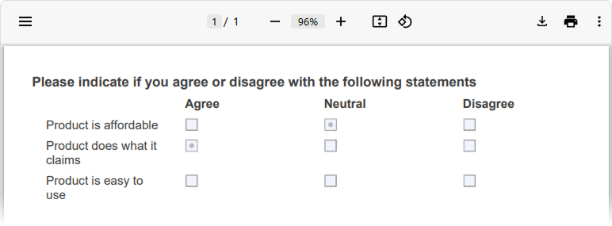
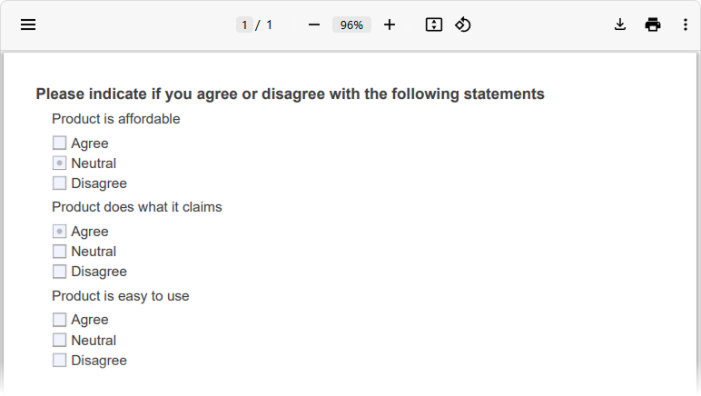

# Customize Survey Questions in PDF

SurveyJS PDF Generator is designed to render survey questions into PDF optimally. At the same time, our tool includes APIs that allow you to adjust and customize question rendering to PDF as per your requirements. This help topic gives an overview of these APIs.

## HTML Rendering

Questions of the [HTML](https://surveyjs.io/form-library/documentation/api-reference/add-custom-html-to-survey) type enable you to add any custom elements to your survey. However, complex HTML markup is difficult to render into PDF primitives without losing interactivity. If the markup mostly consists of textual content, it is rendered into PDF as selectable text. Complex HTML markup is rendered as images. If you want to override this behavior, set the [`htmlRenderAs`](https://surveyjs.io/pdf-generator/documentation/api-reference/idocoptions#htmlRenderAs) property to one of the following values:

- `"standard"`      
Renders HTML questions as selectable text.

- `"image"`     
Renders HTML questions as images.

- `"auto"` (default)    
Selects between the `"standard"` and `"image"` modes automatically based on the HTML content.

```js
const pdfDocOptions = {
  htmlRenderAs: "image" // or "standard" | "auto"
};

const surveyPdf = new SurveyPDF.SurveyPDF(surveyJson, pdfDocOptions);

// In modular applications:
import { SurveyPDF } from "survey-pdf";
const surveyPdf = new SurveyPDF(surveyJson, pdfDocOptions);
```

You can override this property for individual HTML questions. Set the question's `renderAs` property to `"standard"` or `"image"` in the survey JSON schema:

```js
const surveyJson = {
  "elements": [{
    "type": "html",
    // ...
    "renderAs": "image" // or "standard"
  }]
};
```

## Matrix Rendering

[Single-Select Matrix](https://surveyjs.io/form-library/documentation/api-reference/matrix-table-question-model), [Multi-Select Matrix](https://surveyjs.io/form-library/documentation/api-reference/matrix-table-with-dropdown-list), and [Dynamic Matrix](https://surveyjs.io/form-library/documentation/api-reference/dynamic-matrix-table-question-model) questions can be rendered into PDF as tables or lists. Tables are used if matrix content fits into the available page width. Otherwise, matrix content is rendered as a list.

**Matrix rendered as a table**



**Matrix rendered as a list**



If you want to render all matrices as lists, regardless of whether they fit into the page as tables or not, set the [`matrixRenderAs`](https://surveyjs.io/pdf-generator/documentation/api-reference/idocoptions#matrixRenderAs) property to `"list"`:

```js
const pdfDocOptions = {
  matrixRenderAs: "list"
};

const surveyPdf = new SurveyPDF.SurveyPDF(surveyJson, pdfDocOptions);

// In modular applications:
import { SurveyPDF } from "survey-pdf";
const surveyPdf = new SurveyPDF(surveyJson, pdfDocOptions);
```

You can override this property for individual matrix questions. Set the question's `renderAs` property to `"list"` in the survey JSON schema:

```js
const surveyJson = {
  "elements": [{
    "type": "matrix",
    // ...
    "renderAs": "list"
  }]
};
```

## Image Rendering

[Image questions](https://surveyjs.io/form-library/documentation/api-reference/add-image-to-survey) have an [imageFit](https://surveyjs.io/form-library/documentation/api-reference/add-image-to-survey#imageFit) property that specifies how images should fit into their containers. If exported images should apply this property, enable the [`applyImageFit`](https://surveyjs.io/pdf-generator/documentation/api-reference/idocoptions#applyImageFit) option. Please note that with this option, the quality of images may be lower because they pass through several conversions.

```js
const options = {
  applyImageFit: true
};

const surveyPdf = new SurveyPDF.SurveyPDF(surveyJson, pdfDocOptions);

// In modular applications:
import { SurveyPDF } from "survey-pdf";
const surveyPdf = new SurveyPDF(surveyJson, pdfDocOptions);
```

If `applyImageFit` is disabled, exported images fill the entire container and do not preserve their aspect ratio, but their quality remains the same because they are exported as is.

## Read-Only Question Rendering

Read-only questions can be rendered as plain text surrounded by custom primitives or as interactive AcroForms switched to their native read-only state. To specify the desired render mode, set the [`readonlyRenderAs`](https://surveyjs.io/pdf-generator/documentation/api-reference/idocoptions#readonlyRenderAs) property to `"text"` or `"acroform"`:

```js
const pdfDocOptions = {
  readonlyRenderAs: "text" // or "acroform" | "auto"
};

const surveyPdf = new SurveyPDF.SurveyPDF(surveyJson, pdfDocOptions);

// In modular applications:
import { SurveyPDF } from "survey-pdf";
const surveyPdf = new SurveyPDF(surveyJson, pdfDocOptions);
```

The default value of the `readonlyRenderAs` property is `"auto"`. In this mode, SurveyJS PDF Generator renders most elements as plain text but uses AcroForms for [File Upload](https://surveyjs.io/form-library/documentation/api-reference/file-model) questions and links.

You can override the `readonlyRenderAs` property value for individual questions:

```js
import { Model } from "survey-core";
import { SurveyPDF } from "survey-pdf";

const surveyJson = { ... };
const pdfDocOptions = { ... };

const survey = new Model(surveyJson);
const surveyPdf = new SurveyPDF(surveyJson, pdfDocOptions);

surveyPdf.data = survey.data;
surveyPdf.getAllQuestions().forEach(question => {
  if (question.getType() === "file") {
    question.readOnly = true;
    question.readonlyRenderAs = "text";
  }
});
surveyPdf.save(filename);
```

## Custom Rendering

Any PDF document consists of bricks&mdash;simple elements with specified content, size, and location. A brick API is described in the [`PdfBrick`](https://surveyjs.io/pdf-generator/documentation/api-reference/pdfbrick) API reference. When you work with bricks, you need to understand the structure of the bricks that compose the currently rendered questions and access the bricks that contain the element you want to customize, such as the question title, description, or an individual choice. The easiest way to understand the brick structure is to insert a debugger into an [`onRenderQuestion`](https://surveyjs.io/pdf-generator/documentation/api-reference/surveypdf#onRenderQuestion) event handler and investigate the `options.bricks` array using a browser's developer tools:

```js
const surveyPdf = new SurveyPDF.SurveyPDF(surveyJson, pdfDocOptions);
surveyPdf.onRenderQuestion.add((_, options) => {
  debugger;
});

// In modular applications:
import { SurveyPDF } from "survey-pdf";
const surveyPdf = new SurveyPDF(surveyJson, pdfDocOptions);
surveyPdf.onRenderQuestion.add((_, options) => {
  debugger;
});
```

The following code gives an example of brick customization. In this code, question titles are colored differently depending on whether the question answer is correct:

```js
import { ItemValue } from "survey-core";

surveyPdf.onRenderQuestion.add((_, options) => {
  const plainBricks = options.bricks[0].unfold();
  // Color the title green for correct answers or red for incorrect answers
  const color = options.question.isAnswerCorrect() ? "#00ff00" : "#ff0000";
  plainBricks[0].textColor = color; // A brick that renders a question number
  plainBricks[1].textColor = color; // A brick that renders a question title

  // Find a correct answer and access its text brick
  const correctAnswer = ItemValue.getItemByValue(options.question.choices, options.question.correctAnswer);
  const correctAnswerIndex = options.question.choices.indexOf(correctAnswer);
  const correctAnswerRootBrick = options.bricks[correctAnswerIndex];
  const correctAnswerTextBrick = (correctAnswerIndex === 0)
    ? correctAnswerRootBrick.unfold()[4]
    : correctAnswerRootBrick.unfold()[1];
  // Color the correct answer green
  correctAnswerTextBrick.textColor = "#00ff00";
});
```

[View Example on Plunker](https://plnkr.co/edit/nuAYKonXro1apm8X (linkStyle))

For more examples of question customizations, refer to the following demo: [Use Adorners](https://surveyjs.io/pdf-generator/examples/how-to-use-adorners-in-pdf-forms/).