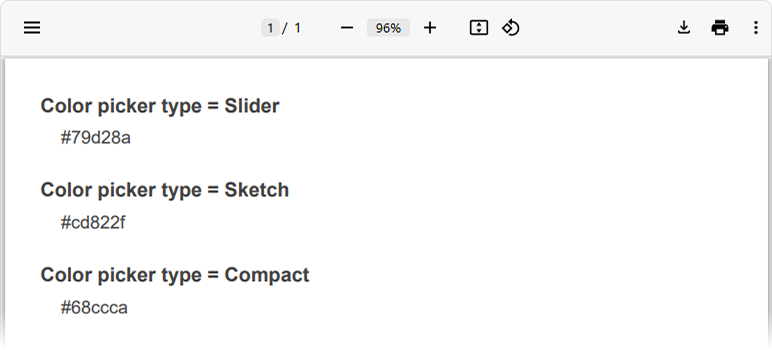
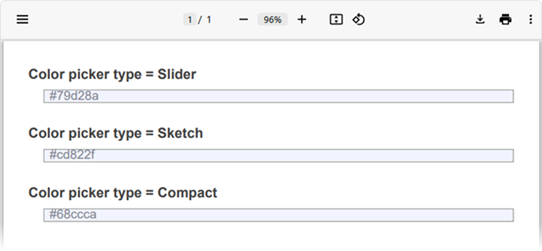
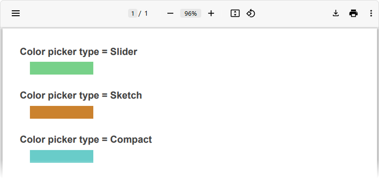

# Export Custom Questions and Third-Party Components to PDF

This help topic describes how to export custom questions that use [third-party components](https://surveyjs.io/form-library/documentation/customize-question-types/third-party-component-integration-react) to PDF. You can export custom questions as plain text, use a predefined renderer to export a custom question as an out-of-the-box question, or implement a custom PDF brick to customize the export as you like.

## Render Custom Questions as Text

SurveyJS PDF Generator exports custom questions as plain non-editable text that displays question values.



Since this is the default behavior, you do not need to specifically configure it.

## Use a Predefined Renderer

If your custom question extends one of the out-of-the-box question types ([`QuestionTextModel`](https://surveyjs.io/form-library/documentation/api-reference/text-entry-question-model), [`QuestionCheckboxModel`](https://surveyjs.io/form-library/documentation/api-reference/checkbox-question-model), [`QuestionDropdownModel`](https://surveyjs.io/form-library/documentation/api-reference/dropdown-menu-model), etc.), it can use the renderer of the extended question type. For instance, the following code specifies the use of a Text Input question renderer to export a custom `color-picker` question:


```js
import { FlatRepository } from "survey-pdf";

FlatRepository.register(
  "color-picker",
  FlatRepository.getRenderer("text")
);
```

The image below illustrates the result:



[View CodeSandbox Example](https://codesandbox.io/s/heuristic-star-81nso2?file=/src/SurveyPdfComponent.jsx:3273-3347 (linkStyle))

## Implement a Custom PDF Brick

If none of the previous options is suitable for your scenario, you can implement a custom PDF brick that uses a [jsPDF API](https://raw.githack.com/MrRio/jsPDF/master/docs/jsPDF.html) to render your custom question. Create a custom class that extends the [`PdfBrick`](https://surveyjs.io/pdf-generator/documentation/api-reference/pdfbrick) class. Within this custom class, implement the `renderInteractive()` method. In the following code, it calls the [`setFillColor()`](https://artskydj.github.io/jsPDF/docs/jsPDF.html#setFillColor) and [`rect()`](https://artskydj.github.io/jsPDF/docs/jsPDF.html#rect) jsPDF methods to render a custom Color question as a rectangle filled with a selected color.


```js
class CustomPdfBrick extends PdfBrick {
  async renderInteractive() {
    const doc = this.controller.doc;
    let oldFillColor = doc.getFillColor();
    doc.setFillColor(this.question.value || "black");
    doc.rect(this.xLeft, this.yTop, this.width, this.height, "F");
    doc.setFillColor(oldFillColor);
  }
}
```

To use this custom PDF brick, you need to configure a custom renderer. Create a custom class that extends the `FlatQuestion` class and implement the `generateFlatsContent()` method within it. This method accepts a drawing start point and returns an array of PDF bricks. Register the custom class as a renderer for your custom question type (`"color-picker"` in the code below).

```js
import { FlatRepository } from "survey-pdf";

/** Custom PDF brick configuration goes here */

class FlatCustomColor extends FlatQuestion {
  async generateFlatsContent(point) {
    const rect = { ...point };
    rect.yBot = point.yTop + 20;
    rect.xRight = point.xLeft + 100;
    return [new CustomPdfBrick(this.question, this.controller, rect)];
  }
}

FlatRepository.register("color-picker", FlatCustomColor);
```

The following image demonstrates the exported PDF document:



[View CodeSandbox Example](https://codesandbox.io/s/gracious-fermat-5n19tr?file=/src/SurveyPdfComponent.jsx:3189-3835 (linkStyle))
