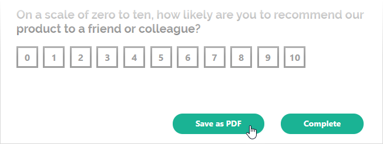

# Export Survey to PDF in a JavaScript Application

PDF Generator for SurveyJS allows your users to save surveys as interactive PDF documents. This tutorial describes how to add the export functionality to your JavaScript application.

[View Full Code on GitHub](https://github.com/surveyjs/code-examples/tree/main/get-started-pdf/html-css-js (linkStyle))

## Link Resources

PDF Generator for SurveyJS is built upon the <a href="https://github.com/parallax/jsPDF#readme" target="_blank">jsPDF</a> library. Insert links to the jsPDF and SurveyJS PDF Generator scripts within the `<head>` tag on your HTML page:

```html
<head>
    <!-- jsPDF library -->
    <script src="https://unpkg.com/jspdf@latest/dist/jspdf.umd.min.js"></script>

    <!-- SurveyJS PDF Generator library -->
    <script src="https://unpkg.com/survey-pdf/survey.pdf.min.js"></script>
    <!-- ... -->
</head>
```

## Configure Export Properties

Export properties allow you to customize the page format, orientation, margins, font, and other parameters. Refer to the [`IDocOptions`](/Documentation/Pdf-Export?id=idocoptions) interface for a full list of properties. The following code changes the [`fontSize`](/Documentation/Pdf-Export?id=idocoptions#fontSize) property:

```js
const pdfDocOptions = {
    fontSize: 12
};
```

## Export a Survey

To export a survey, you need to create a `SurveyPDF` instance. Its constructor accepts two parameters: a [survey JSON schema](/Documentation/Library?id=design-survey-create-a-simple-survey#define-a-static-survey-model-in-json) and [export properties](#configure-export-properties). To save a PDF document with the exported survey, call the [`save(fileName)`](/Documentation/Pdf-Export?id=surveypdf#save) method on the `SurveyPDF` instance. If you omit the `fileName` parameter, the document uses the default name (`"survey_result"`).

The code below implements a `savePdf` helper function that instantiates `SurveyPDF`, assigns survey data (user responses) to this instance, and calls the `save(fileName)` method. If you want to export the survey without user responses, do not specify the `SurveyPDF`'s `data` property.

```js
const surveyJson = { /* ... */ };

const pdfDocOptions = { /* ... */ };

const savePdf = function (surveyData) {
    const surveyPdf = new SurveyPDF.SurveyPDF(surveyJson, pdfDocOptions);
    surveyPdf.data = surveyData;
    surveyPdf.save();
};
```

You can use any UI element to call this helper function. For instance, the following code adds a new [navigation button](/Documentation/Library?id=iaction) below the survey and calls the `savePdf` function when a user clicks this button:

```js
const survey = new Survey.Model(surveyJson);

survey.addNavigationItem({
    id: "pdf-export",
    title: "Save as PDF",
    action: () => savePdf(survey.data)
});
```

The following image illustrates the resulting UI with the [Default theme](https://surveyjs.io/form-library/documentation/manage-default-themes-and-styles) applied:



<details>
    <summary>View Full Code</summary>  

```html
<!DOCTYPE html>
<html>
<head>
    <title>Export Survey to PDF - SurveyJS</title>
    <meta charset="utf-8">
    <!-- jsPDF library -->
    <script src="https://unpkg.com/jspdf@latest/dist/jspdf.umd.min.js"></script>

    <link href="https://unpkg.com/survey-core/survey-core.min.css" type="text/css" rel="stylesheet">
    <script type="text/javascript" src="https://unpkg.com/survey-core/survey.core.min.js"></script>
    <script type="text/javascript" src="https://unpkg.com/survey-js-ui/survey-js-ui.min.js"></script>

    <!-- SurveyJS PDF Generator library -->
    <script src="https://unpkg.com/survey-pdf/survey.pdf.min.js"></script>
    
    <script type="text/javascript" src="index.js"></script>
</head>
<body>
    <div id="surveyContainer"></div>
</body>
</html>
```

```js
const surveyJson = {
    // ...
};

const survey = new Survey.Model(surveyJson);

const pdfDocOptions = {
    fontSize: 12
};

const savePdf = function (surveyData) {
    const surveyPdf = new SurveyPDF.SurveyPDF(surveyJson, pdfDocOptions);
    surveyPdf.data = surveyData;
    surveyPdf.save();
};

survey.addNavigationItem({
    id: "pdf-export",
    title: "Save as PDF",
    action: () => savePdf(survey.data)
});

document.addEventListener("DOMContentLoaded", function() {
    survey.render(document.getElementById("surveyContainer"));
});
```
</details>

[View Full Code on GitHub](https://github.com/surveyjs/code-examples/tree/main/get-started-pdf/html-css-js (linkStyle))

## Further Reading

- [Customization Options](/Documentation/Pdf-Export?id=Customization-Options)
- [Export HTML to PDF](/Documentation/Pdf-Export?id=HtmlToPdf)
- [Export Matrix Questions to PDF](/Documentation/Pdf-Export?id=MatrixToPdf)