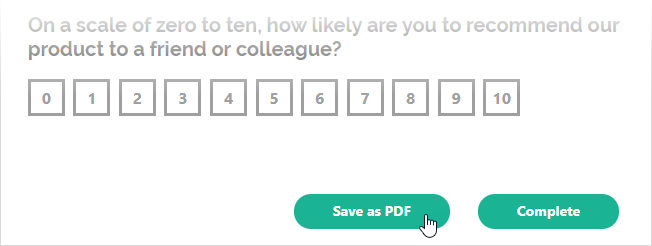
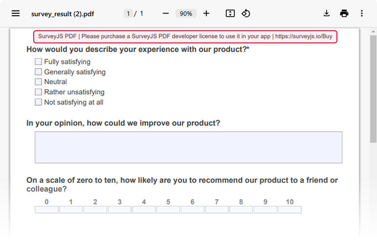

# Export Survey to PDF in a React Application

PDF Generator for SurveyJS allows your users to save surveys as interactive PDF documents. This tutorial describes how to add the export functionality to your React application.

[View Full Code on GitHub](https://github.com/surveyjs/code-examples/tree/main/get-started-pdf/react (linkStyle))

If you are looking for a quick-start application that includes all SurveyJS components, refer to the following GitHub repositories:

- <a href="https://github.com/surveyjs/surveyjs-nextjs" target="_blank">SurveyJS + Next.js</a>
- <a href="https://github.com/surveyjs/surveyjs-remix" target="_blank">SurveyJS + Remix</a>

## Install the `survey-pdf` npm package

PDF Generator for SurveyJS is built upon the <a href="https://github.com/parallax/jsPDF#readme" target="_blank">jsPDF</a> library and is distributed as a <a href="https://www.npmjs.com/package/survey-pdf" target="_blank">`survey-pdf`</a> npm package. Run the following command to install the package and its dependencies, including jsPDF:

```cmd
npm install survey-pdf
```

## Export a Survey

To export a survey, you need to create a `SurveyPDF` instance. Its constructor accepts two parameters: a [survey JSON schema](/Documentation/Library?id=design-survey-create-a-simple-survey#define-a-static-survey-model-in-json) and optional [PDF document settings](/pdf-generator/documentation/api-reference/idocoptions).

To save a PDF document with the exported survey, call the [`save(fileName)`](/Documentation/Pdf-Export?id=surveypdf#save) method on the `SurveyPDF` instance. If you omit the `fileName` parameter, the document uses the default name (`"survey_result"`).

The code below implements a `savePdf` helper function that instantiates `SurveyPDF`, assigns survey data (user responses) to this instance, and calls the `save(fileName)` method. If you want to export the survey without user responses, do not specify the `SurveyPDF`'s `data` property.

```js
import { IDocOptions, SurveyPDF } from "survey-pdf";

const surveyJson = { /* ... */ };
const pdfDocOptions: IDocOptions = { /* ... */ };

const savePdf = function (surveyData) {
  const surveyPdf = new SurveyPDF(surveyJson, pdfDocOptions);
  surveyPdf.data = surveyData;
  surveyPdf.save();
};
```

The following image illustrates a generated PDF form:


You can call this helper function from any UI element. The following example adds a custom [navigation button](/Documentation/Library?id=iaction) below the survey and exports the current survey state when users click the button.

> SurveyJS components are client-side components. Explicitly mark the React component that renders a SurveyJS component as client code using the ['use client'](https://react.dev/reference/react/use-client) directive.

```js
'use client'

import { Model } from 'survey-core';
import { Survey } from 'survey-react-ui';

const savePdf = function (surveyData) {
  // ...
};

export default function SurveyComponent() {
  const survey = new Model(surveyJson);
  
  survey.addNavigationItem({
    id: "pdf-export",
    title: "Save as PDF",
    action: () => savePdf(survey.data)
  });

  return (
    <Survey model={survey} id="surveyContainer" />
  );
}
```

The following image illustrates the resulting UI:



To view the application, run `npm run dev` in a command line and open [http://localhost:3000/](http://localhost:3000/) in your browser.

## Customize the PDF Form

If the default appearance of the exported form does not meet your requirements, use the following customization APIs to tailor the generated PDF document:

- [PDF Form Settings](/pdf-generator/documentation/customize-pdf-form-settings)     
Configure page orientation, fonts, compression, read-only mode, and other document-level settings.

- [PDF Appearance Customization](/pdf-generator/documentation/pdf-appearance-customization)      
Customize themes, layouts, and styles.

- [Question Rendering](/pdf-generator/documentation/customize-survey-question-rendering-in-pdf-form)      
Customize the rendering behavior of specific question types.

In this tutorial, the exported PDF form uses the print-optimized Monochrome Light theme:

```js
import { MonochromeLight } from "survey-core/themes";

const surveyPdf = new SurveyPDF({ /* ... */ });
surveyPdf.applyTheme(MonochromeLight);
```

<details>
    <summary>View Full Code</summary>  

```js
// components/Survey.tsx
'use client'

import 'survey-core/survey-core.css';
import { Model } from 'survey-core';
import { Survey } from 'survey-react-ui';
import { IDocOptions, SurveyPDF } from 'survey-pdf';
import { MonochromeLight } from "survey-core/themes";

const surveyJson = {
  "title": "NPS Survey Question",
  "description": "NPS (net promoter score) is a metric used to evaluate customer loyalty and business growth opportunities. To measure NPS, respondents should rate on a scale of 0 to 10 how likely they would recommend your product or service to a friend or colleague.",
  "pages": [
    {
      "name": "page1",
      "elements": [
        {
          "type": "rating",
          "name": "nps-score",
          "title": "On a scale from 0 to 10, how likely are you to recommend us to a friend or colleague?",
          "rateMin": 0,
          "rateMax": 10
        },
        {
          "type": "comment",
          "name": "disappointing-experience",
          "title": "If your score is 0 to 5, how did we disappoint you and what can we do to improve?",
          "maxLength": 300
        },
        {
          "type": "comment",
          "name": "improvements-required",
          "title": "If your score is 6 or higher, what can we do to improve your experience?",
          "maxLength": 300
        },
        {
          "type": "checkbox",
          "name": "promoter-features",
          "title": "If your score is 9 or 10, which features do you value most?",
          "description": "Select up to three features, if applicable.",
          "choices": [
            {
              "value": "performance",
              "text": "Performance"
            },
            {
              "value": "stability",
              "text": "Stability"
            },
            {
              "value": "ui",
              "text": "User interface"
            },
            {
              "value": "complete-functionality",
              "text": "Complete functionality"
            },
            {
              "value": "learning-materials",
              "text": "Learning materials"
            },
            {
              "value": "support",
              "text": "Support quality"
            }
          ],
          "showOtherItem": true,
          "otherText": "Other",
          "colCount": 2,
          "maxSelectedChoices": 3
        }
      ]
    },
    {
      "name": "page2",
      "elements": [
        {
          "type": "boolean",
          "name": "rebuy",
          "title": "Would you buy our product again?"
        }
      ]
    },
    {
      "name": "page3",
      "elements": [
        {
          "type": "boolean",
          "name": "testimonial",
          "title": "Would you be willing to provide a short testimonial?"
        },
        {
          "type": "text",
          "name": "email",
          "title": "If yes, enter your email address",
          "inputType": "email"
        }
      ]
    }
  ],
  "questionsOnPageMode": "singlePage",
  "headerView": "advanced"
};

const pdfDocOptions: IDocOptions = { };

const savePdf = (surveyData: any) => {
  const surveyPdf = new SurveyPDF(surveyJson, pdfDocOptions);
  surveyPdf.data = surveyData;
  surveyPdf.applyTheme(MonochromeLight);
  surveyPdf.save();
};

export default function SurveyComponent() {
  const survey = new Model(surveyJson);
  
  survey.addNavigationItem({
    id: "pdf-export",
    title: "Save as PDF",
    action: () => savePdf(survey.data)
  });

  return (
    <Survey model={survey} id="surveyContainer" />
  );
}
```

```js
// survey/page.tsx
import SurveyComponent from '@/components/Survey';

export default function Survey() {
  return (
    <SurveyComponent />
  );
}

```

</details>

[View Full Code on GitHub](https://github.com/surveyjs/code-examples/tree/main/get-started-pdf/react (linkStyle))

## Activate a SurveyJS License

SurveyJS PDF Generator is not available for free commercial use. To integrate it into your application, you must purchase a [commercial license](https://surveyjs.io/licensing) for the software developer(s) who will be working with the PDF Generator APIs and implementing the integration. If you use SurveyJS PDF Generator without a license, an alert banner will appear at the top of each page in an exported PDF document:



After purchasing a license, follow the steps below to activate it and remove the alert banner:

1. [Log in](https://surveyjs.io/login) to the SurveyJS website using your email address and password. If you've forgotten your password, [request a reset](https://surveyjs.io/reset-password) and check your inbox for the reset link.
2. Open the following page: [How to Remove the Alert Banner](https://surveyjs.io/remove-alert-banner). You can also access it by clicking **Set up your license key** in the alert banner itself.
3. Follow the instructions on that page.

Once you've completed the setup correctly, the alert banner will no longer appear.

## See Also

- [Fill PDF Form with Web Form Responses](/pdf-generator/documentation/fill-pdf-form-with-web-form-responses)
- [PDF Generator Demos](/pdf-generator/examples/save-completed-forms-as-pdf-files/)