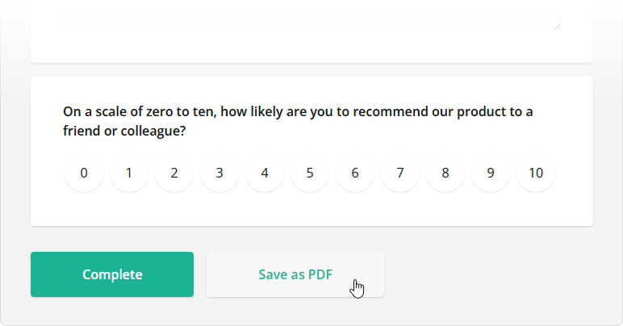

# Export Survey to PDF in a Vue.js Application

PDF Generator for SurveyJS allows your users to save surveys as interactive PDF documents. This tutorial describes how to add the export functionality to your Vue application.

- [Install the `survey-pdf` npm package](#install-the-survey-pdf-npm-package)
- [Configure Export Properties](#configure-export-properties)
- [Export a Survey](#export-a-survey)

[View Full Code on GitHub](https://github.com/surveyjs/code-examples/tree/main/get-started-pdf/vue (linkStyle))

If you are looking for a quick-start application that includes all SurveyJS components, refer to the following GitHub repositories:

- <a href="https://github.com/surveyjs/surveyjs_vue3_quickstart" target="_blank">SurveyJS + Vue 3 Quickstart Template</a>
- <a href="https://github.com/surveyjs/surveyjs_vue_quickstart" target="_blank">SurveyJS + Vue 2 Quickstart Template</a>

## Install the `survey-pdf` npm package

PDF Generator for SurveyJS is built upon the <a href="https://github.com/parallax/jsPDF#readme" target="_blank">jsPDF</a> library and is distributed as a <a href="https://www.npmjs.com/package/survey-pdf" target="_blank">`survey-pdf`</a> npm package. Run the following command to install the package and its dependencies, including jsPDF:

```cmd
npm install survey-pdf --save
```

## Configure Export Properties

Export properties allow you to customize the page format, orientation, margins, font, and other parameters. Refer to the [`IDocOptions`](/Documentation/Pdf-Export?id=idocoptions) interface for a full list of properties. The following code changes the [`fontSize`](/Documentation/Pdf-Export?id=idocoptions#fontSize) property:

```js
const pdfDocOptions = {
    fontSize: 12
};
```

## Export a Survey

To export a survey, you need to create a `SurveyPDF` instance. Its constructor accepts two parameters: a [survey JSON schema](/Documentation/Library?id=design-survey-create-a-simple-survey#define-a-static-survey-model-in-json) and [export properties](#configure-export-properties). To save a PDF document with the exported survey, call the [`save(fileName)`](/Documentation/Pdf-Export?id=surveypdf#save) method on the `SurveyPDF` instance. If you omit the `fileName` parameter, the document uses the default name (`"survey_result"`).

The code below implements a `savePdf` helper function that instantiates `SurveyPDF`, assigns survey data (user responses) to this instance, and calls the `save(fileName)` method. If you want to export the survey without user responses, do not specify the `SurveyPDF`'s `data` property.

```js
import { SurveyPDF } from "survey-pdf";

const surveyJson = { /* ... */ };

const pdfDocOptions = { /* ... */ };

const savePdf = function (surveyData) {
  const surveyPdf = new SurveyPDF(surveyJson, pdfDocOptions);
  surveyPdf.data = surveyData;
  surveyPdf.save();
};
```

You can use any UI element to call this helper function. For instance, the following code adds a new [navigation button](/Documentation/Library?id=iaction) below the survey and calls the `savePdf` function when a user clicks this button:

```js
<template>
  <div>
    <Survey :survey="survey" id="surveyContainer" />
  </div>
</template>

<script>
import 'survey-core/defaultV2.min.css';
import { Model } from 'survey-core';
import { Survey } from 'survey-vue-ui';
// ...
export default {
  name: 'MySurvey',
  components: {
    Survey
  },
  data() {
    const survey = new Model(surveyJson);

    survey.addNavigationItem({
      id: "pdf-export",
      title: "Save as PDF",
      action: () => savePdf(survey.data)
    });

    return {
      survey
    }
  }
}
</script>
```

The following image illustrates the resulting UI with the [Default V2 theme](/Documentation/Library?id=get-started-vue#configure-styles) applied:



To view the application, run `npm run serve` in a command line and open [http://localhost:8080/](http://localhost:8080/) in your browser.

<details>
    <summary>View Full Code</summary>  

```js
<template>
  <div>
    <Survey :survey="survey" id="surveyContainer" />
  </div>
</template>

<script>
import 'survey-core/defaultV2.min.css';
import { Model } from 'survey-core';
import { Survey } from 'survey-vue-ui';
import { SurveyPDF } from 'survey-pdf';

const surveyJson = {
  // ...
};

const pdfDocOptions = {
  fontSize: 12
};

const savePdf = function (surveyData) {
  const surveyPdf = new SurveyPDF(surveyJson, pdfDocOptions);
  surveyPdf.data = surveyData;
  surveyPdf.save();
};

export default {
  name: 'MySurvey',
  components: {
    Survey
  },
  data() {
    const survey = new Model(surveyJson);

    survey.addNavigationItem({
      id: "pdf-export",
      title: "Save as PDF",
      action: () => savePdf(survey.data)
    });

    return {
      survey
    }
  }
}
</script>
```
</details>

[View Full Code on GitHub](https://github.com/surveyjs/code-examples/tree/main/get-started-pdf/vue (linkStyle))

## Further Reading

- [Customization Options](/Documentation/Pdf-Export?id=Customization-Options)
- [Export HTML to PDF](/Documentation/Pdf-Export?id=HtmlToPdf)
- [Export Matrix Questions to PDF](/Documentation/Pdf-Export?id=MatrixToPdf)